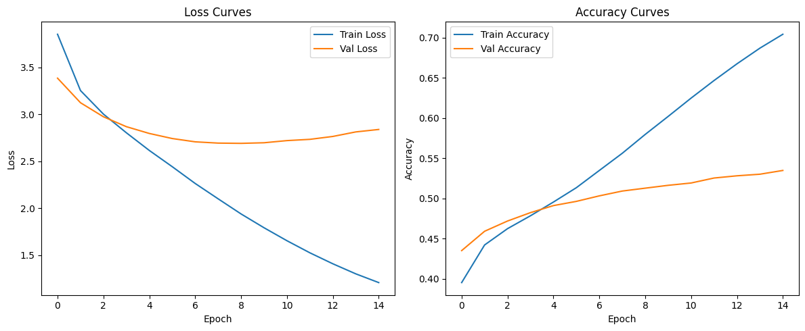

# 🚀 **Conv_GPT**  

Conv_GPT is a **conversational AI model** trained from scratch using the **Persona-Chat** dataset. The goal is to build an **engaging chatbot** capable of understanding and maintaining persona-based dialogues.  

---

## 🚧 **Project Status**  

🔹 This project is **currently in progress**.  
🔹 Future updates will include:  
✅ **Better Model**  
✅ **Deployment instructions**  

---

## 📌 **Features**  

✔️ **Trainable from scratch** (**≈56M parameters**)  
✔️ **Persona-based conversations**  
✔️ **Optimized training with mixed precision**   

---

## 📂 **Dataset**  

Conv_GPT is trained using the **[Persona-Chat Truecased dataset](https://huggingface.co/datasets/bavard/personachat_truecased)**

---

## 📊 **Training Results**  

### **Training Accuracy & Loss Graphs**  
Here’s the visualization of **training accuracy and loss**:  

  

---

## 🛠 **Training Setup**  

- **Framework:** PyTorch  
- **GPU:** T4 (Colab)  
- **Model:** GPT-2 trained from scratch
- **Total Parameters:** **56M**    

### **Model Configuration**  
| Parameter       | Value  |
|----------------|--------|
| **Vocabulary Size** | `50257` |
| **Embedding Dimension** | `384` |
| **Number of Attention Heads** | `12` |
| **Number of Layers** | `12` |
| **Sequence Length** | `256` |
---

 

 

